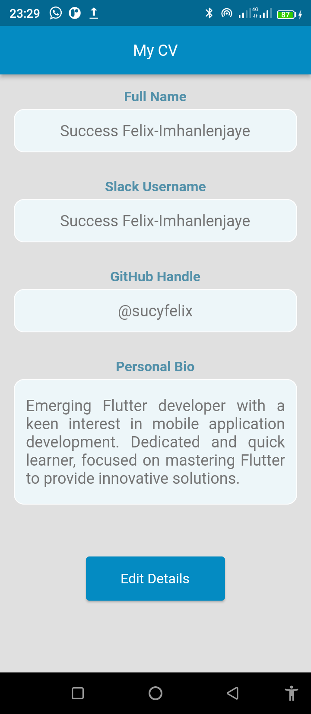
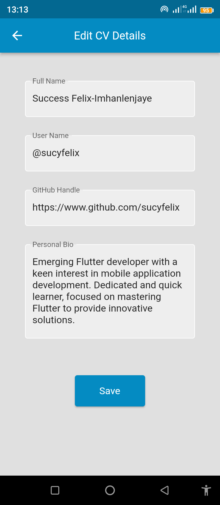

# HNG STAGE 2 TASK

## Overview

HNG STAGE 2 TASK is a simple Flutter application that allows you to showcase your CV details. It consists of two screens: the first screen displays your CV information, and the second screen allows you to edit and update your details.

## Features

- View your CV details, including your full name, username, GitHub handle, and personal bio.
- Edit and update your CV information.
- Elegant and user-friendly UI design.

## Screenshots

 

## Usage

### Appetizer Usage:
___ 
* Copy and paste this url on your browser: 
 https://appetize.io/app/vip3ce7fvgrdnm5jidc5eonjla?device=pixel7pro&osVersion=13.0&scale=50

* Use the pixel 7 pro on android 13 to view

* Click on 'Tap to Play' on the emulator

### IDE setup:
- Clone this repository:
git clone https://github.com/sucyfelix/HNG_STAGE2_TASK.git

- Navigate to the project directory:
cd your-flutter-app

## Folder Structure
The project folder structure should resemble the following:

- hng_stage2_task/
│
├── lib/
│   ├── main.dart
│   ├── screens/
│   │   ├── first_screen.dart
│   │   ├── ...
│   │
│   
│
├── assets/
│   ├── screenshots/
│   │   ├── screen1.png
│   │   ├── ...
│   
│
├── pubspec.yaml
│
├── README.md
│
└── ...

- lib/: Contains the main Dart code for your Flutter app.
- assets/: Includes images that your app may use.
- pubspec.yaml: Lists the project's dependencies and assets.

## Dependencies:
- No dependencies, tools, plugins, or packages were used in this app. Only very basic state management, using setState.

## Running the App
- Ensure you have cloned the repository

- Open the project in VS Code or your preferred IDE.

- Run the app on your emulator or physical device:

- #### flutter run

- Explore your CV details on the first screen.

- Tap "Edit Details" to navigate to the second screen for editing.

- Make your desired changes and save.

- Your updated CV details will be displayed on the first screen.

## Customization
You can customize the app by modifying the colors, fonts, and layouts in the code to match your personal style.

## ASSUMPTIONS
It is assumed that you have flutter installed on your personal computer, Windows or MAC OS

## Testing
- To run tests for the app, execute the following command:

- #### flutter test

## Deployment
You can check https://www.flutter.dev for more information

## Contributing
If you'd like to contribute to this project, please follow these guidelines:

- #### Fork the repository on GitHub.

- #### Clone your fork locally.

- Create a new branch for your feature or bug fix.

- Make changes and commit them with clear and concise commit messages.

- #### Push your branch to your fork on GitHub.
- Create a pull request with a description of your changes.

___
Thank you for showing interest in HNG STAGE 2 TASK! If you have any questions, feedback, or suggestions, feel free to contact me via email or through my GitHub profile. Your input is valuable, and I look forward to enhancing this project together.